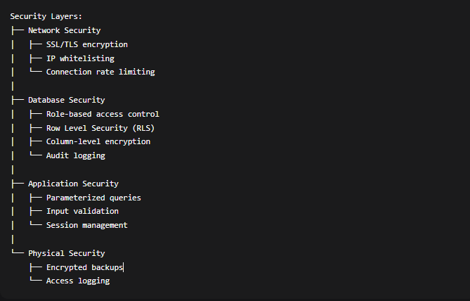

## 📁 case-study/security.md

```markdown
# 🔐 Security Implementation & Analysis
# Argan Database Security Case Study

## 📊 Executive Summary

This document details the security architecture of the Argan Cooperative Database, implementing defense-in-depth principles to protect sensitive business data, producer information, and financial records.

## 🎯 Security Objectives

1. **Confidentiality:** Protect sensitive data from unauthorized access
2. **Integrity:** Ensure data accuracy and prevent tampering
3. **Availability:** Maintain system accessibility for authorized users
4. **Auditability:** Track all access and changes to sensitive data
5. **Compliance:** Meet data protection regulations (GDPR, local laws)

## 🔐 Security Architecture Overview



### Detailed Permissions

```bash
-- Role creation
CREATE ROLE admin_role;
CREATE ROLE gestionnaire_role;
CREATE ROLE caissier_role;
CREATE ROLE collecteur_role;
CREATE ROLE client_role;

-- Administrator (Full access)
GRANT ALL PRIVILEGES ON ALL TABLES IN SCHEMA public TO admin_role;
GRANT ALL PRIVILEGES ON ALL SEQUENCES IN SCHEMA public TO admin_role;

-- Manager (Business operations)
GRANT SELECT, INSERT, UPDATE ON
    producteurs, collectes, produits, commandes,
    factures, transformation, employees, raw_materials
TO gestionnaire_role;

GRANT SELECT ON
    clients, paiements, depense, mouvements_stock
TO gestionnaire_role;

-- Cashier (Financial operations)
GRANT SELECT, INSERT, UPDATE ON
    commandes, factures, paiements, clients
TO caissier_role;

GRANT SELECT ON
    produits, utilisateurs
TO caissier_role;

-- Collector (Field operations)
GRANT SELECT, INSERT, UPDATE ON
    collectes, producteurs
TO collecteur_role;

GRANT SELECT ON
    produits
TO collecteur_role;

-- Client (Self-service)
GRANT SELECT ON
    produits, commandes
TO client_role;

GRANT UPDATE ON
    clients
TO client_role WHERE id_client = current_setting('app.current_user_id')::INTEGER;
```
## Row Level Security (RLS)
### Implementation

```bash
-- Enable RLS on sensitive tables
ALTER TABLE collectes ENABLE ROW LEVEL SECURITY;
ALTER TABLE producteurs ENABLE ROW LEVEL SECURITY;
ALTER TABLE clients ENABLE ROW LEVEL SECURITY;
ALTER TABLE factures ENABLE ROW LEVEL SECURITY;
ALTER TABLE paiements ENABLE ROW LEVEL SECURITY;

-- Collectes: Producers can only see their own collections
CREATE POLICY collectes_access_policy ON collectes
FOR ALL USING (
    -- Admin sees all
    current_setting('app.current_user_role', true) = 'admin'
    OR
    -- Managers see all
    current_setting('app.current_user_role', true) = 'gestionnaire'
    OR
    -- Collectors see their own collections
    (current_setting('app.current_user_role', true) = 'collecteur'
     AND id_utilisateur = current_setting('app.current_user_id', true)::INTEGER)
    OR
    -- Producers see their own data
    (current_setting('app.producer_id', true)::INTEGER = idproducteur)
);

-- Clients: Can only see their own data
CREATE POLICY clients_self_service ON clients
FOR SELECT USING (
    current_setting('app.current_user_role', true) = 'admin'
    OR
    current_setting('app.current_user_role', true) = 'gestionnaire'
    OR
    current_setting('app.current_user_role', true) = 'caissier'
    OR
    id_client = current_setting('app.current_user_id', true)::INTEGER
);

-- Producteurs: Privacy protection
CREATE POLICY producteurs_privacy ON producteurs
FOR SELECT USING (
    current_setting('app.current_user_role', true) = 'admin'
    OR
    current_setting('app.current_user_role', true) = 'gestionnaire'
    OR
    current_setting('app.current_user_role', true) = 'collecteur'
    OR
    idproducteur = current_setting('app.producer_id', true)::INTEGER
);
```
## Authentication & Password Security
### Password Policies

```bash
-- Strong password requirements
CREATE OR REPLACE FUNCTION validate_password(password TEXT)
RETURNS BOOLEAN AS $$
BEGIN
    -- Minimum 8 characters
    -- At least one uppercase, one lowercase, one digit, one special character
    RETURN (
        length(password) >= 8 AND
        password ~ '[A-Z]' AND      -- Uppercase letter
        password ~ '[a-z]' AND      -- Lowercase letter
        password ~ '[0-9]' AND      -- Digit
        password ~ '[!@#$%^&*(),.?":{}|<>]' -- Special character
    );
END;
$$ LANGUAGE plpgsql SECURITY DEFINER;

-- Password hashing with bcrypt (12 rounds)
CREATE OR REPLACE FUNCTION create_user(
    p_login VARCHAR,
    p_password VARCHAR,
    p_role VARCHAR
) RETURNS INTEGER AS $$
DECLARE
    user_id INTEGER;
BEGIN
    -- Validate password strength
    IF NOT validate_password(p_password) THEN
        RAISE EXCEPTION 'Password does not meet security requirements';
    END IF;

    -- Hash password with work factor 12
    INSERT INTO utilisateurs (login, mot_de_passe, role, nom, prenom)
    VALUES (
        p_login,
        crypt(p_password, gen_salt('bf', 12)),
        p_role,
        'New',  -- Default values
        'User'
    )
    RETURNING id_utilisateur INTO user_id;

    RETURN user_id;
END;
$$ LANGUAGE plpgsql SECURITY DEFINER;

-- Password update with validation
CREATE OR REPLACE FUNCTION update_password(
    p_user_id INTEGER,
    p_current_password TEXT,
    p_new_password TEXT
) RETURNS BOOLEAN AS $$
BEGIN
    -- Verify current password
    IF NOT EXISTS (
        SELECT 1 FROM utilisateurs
        WHERE id_utilisateur = p_user_id
        AND mot_de_passe = crypt(p_current_password, mot_de_passe)
    ) THEN
        RAISE EXCEPTION 'Current password is incorrect';
    END IF;

    -- Validate new password
    IF NOT validate_password(p_new_password) THEN
        RAISE EXCEPTION 'New password does not meet security requirements';
    END IF;

    -- Update password
    UPDATE utilisateurs
    SET mot_de_passe = crypt(p_new_password, gen_salt('bf', 12))
    WHERE id_utilisateur = p_user_id;

    RETURN TRUE;
END;
$$ LANGUAGE plpgsql SECURITY DEFINER;
```

## Session Management

```bash
-- Track user sessions
CREATE TABLE user_sessions (
    session_id UUID PRIMARY KEY DEFAULT gen_random_uuid(),
    user_id INTEGER NOT NULL REFERENCES utilisateurs(id_utilisateur),
    login_time TIMESTAMP DEFAULT CURRENT_TIMESTAMP,
    last_activity TIMESTAMP DEFAULT CURRENT_TIMESTAMP,
    ip_address INET,
    user_agent TEXT,
    expires_at TIMESTAMP NOT NULL DEFAULT (CURRENT_TIMESTAMP + INTERVAL '8 hours'),
    is_active BOOLEAN DEFAULT TRUE
);

CREATE INDEX idx_user_sessions_user_id ON user_sessions(user_id);
CREATE INDEX idx_user_sessions_expires ON user_sessions(expires_at);

-- Create session
CREATE OR REPLACE FUNCTION create_session(
    p_user_id INTEGER,
    p_ip_address INET DEFAULT NULL,
    p_user_agent TEXT DEFAULT NULL
) RETURNS UUID AS $$
DECLARE
    v_session_id UUID;
BEGIN
    INSERT INTO user_sessions (user_id, ip_address, user_agent)
    VALUES (p_user_id, p_ip_address, p_user_agent)
    RETURNING session_id INTO v_session_id;

    RETURN v_session_id;
END;
$$ LANGUAGE plpgsql SECURITY DEFINER;

-- Validate session
CREATE OR REPLACE FUNCTION validate_session(
    p_session_id UUID
) RETURNS INTEGER AS $$
DECLARE
    v_user_id INTEGER;
BEGIN
    SELECT user_id INTO v_user_id
    FROM user_sessions
    WHERE session_id = p_session_id
      AND is_active = TRUE
      AND expires_at > CURRENT_TIMESTAMP
      AND last_activity > (CURRENT_TIMESTAMP - INTERVAL '30 minutes');

    IF v_user_id IS NULL THEN
        RAISE EXCEPTION 'Invalid or expired session';
    END IF;

    -- Update last activity
    UPDATE user_sessions
    SET last_activity = CURRENT_TIMESTAMP
    WHERE session_id = p_session_id;

    RETURN v_user_id;
END;
$$ LANGUAGE plpgsql SECURITY DEFINER;

-- Cleanup expired sessions
CREATE OR REPLACE FUNCTION cleanup_expired_sessions()
RETURNS void AS $$
BEGIN
    UPDATE user_sessions
    SET is_active = FALSE
    WHERE (expires_at < CURRENT_TIMESTAMP
           OR last_activity < (CURRENT_TIMESTAMP - INTERVAL '24 hours'))
      AND is_active = TRUE;
END;
$$ LANGUAGE plpgsql;

-- Schedule cleanup (requires pg_cron extension)
-- SELECT cron.schedule('0 */6 * * *', 'SELECT cleanup_expired_sessions();');
```

## Data Encryption
### Column-Level Encryption

```bash
-- Enable encryption extension
CREATE EXTENSION IF NOT EXISTS pgcrypto;

-- Sensitive data encryption function
CREATE OR REPLACE FUNCTION encrypt_sensitive_data(
    plain_text TEXT,
    encryption_key TEXT
) RETURNS BYTEA AS $$
BEGIN
    RETURN pgp_sym_encrypt(
        plain_text,
        encryption_key,
        'compress-algo=1, cipher-algo=aes256'
    );
END;
$$ LANGUAGE plpgsql SECURITY DEFINER;

-- Decryption function (restricted access)
CREATE OR REPLACE FUNCTION decrypt_sensitive_data(
    encrypted_data BYTEA,
    encryption_key TEXT
) RETURNS TEXT AS $$
BEGIN
    -- Only allow decryption by authorized roles
    IF NOT current_setting('app.current_user_role', true) IN ('admin', 'gestionnaire') THEN
        RAISE EXCEPTION 'Unauthorized decryption attempt';
    END IF;

    RETURN pgp_sym_decrypt(
        encrypted_data,
        encryption_key,
        'compress-algo=1, cipher-algo=aes256'
    );
END;
$$ LANGUAGE plpgsql SECURITY DEFINER;

-- Example: Encrypt client email (would modify clients table)
-- ALTER TABLE clients ADD COLUMN email_encrypted BYTEA;
-- CREATE OR REPLACE FUNCTION encrypt_client_email() RETURNS TRIGGER AS $$
-- BEGIN
--     NEW.email_encrypted = encrypt_sensitive_data(NEW.email, 'client-encryption-key');
--     NEW.email = NULL; -- Clear plain text
--     RETURN NEW;
-- END;
-- $$ LANGUAGE plpgsql;
```

## Audit Logging
### Comprehensive Audit System
```bash
-- Audit table for all sensitive operations
CREATE TABLE audit_log (
    audit_id BIGSERIAL PRIMARY KEY,
    event_time TIMESTAMP DEFAULT CURRENT_TIMESTAMP,
    user_id INTEGER REFERENCES utilisateurs(id_utilisateur),
    user_role VARCHAR(20),
    table_name VARCHAR(50),
    operation VARCHAR(10), -- INSERT, UPDATE, DELETE, SELECT
    old_values JSONB,
    new_values JSONB,
    ip_address INET,
    user_agent TEXT,
    application_name TEXT
);

CREATE INDEX idx_audit_log_event_time ON audit_log(event_time);
CREATE INDEX idx_audit_log_user_id ON audit_log(user_id);
CREATE INDEX idx_audit_log_table_name ON audit_log(table_name);

-- Generic audit trigger function
CREATE OR REPLACE FUNCTION audit_trigger_function()
RETURNS TRIGGER AS $$
DECLARE
    v_user_id INTEGER;
    v_user_role VARCHAR;
BEGIN
    -- Get current user info from session settings
    BEGIN
        v_user_id := current_setting('app.current_user_id', true)::INTEGER;
        v_user_role := current_setting('app.current_user_role', true);
    EXCEPTION WHEN OTHERS THEN
        v_user_id := NULL;
        v_user_role := NULL;
    END;

    IF (TG_OP = 'INSERT') THEN
        INSERT INTO audit_log (
            user_id, user_role, table_name, operation,
            new_values, ip_address, application_name
        ) VALUES (
            v_user_id,
            v_user_role,
            TG_TABLE_NAME,
            TG_OP,
            to_jsonb(NEW),
            inet_client_addr(),
            current_setting('application_name', true)
        );
        RETURN NEW;

    ELSIF (TG_OP = 'UPDATE') THEN
        INSERT INTO audit_log (
            user_id, user_role, table_name, operation,
            old_values, new_values, ip_address, application_name
        ) VALUES (
            v_user_id,
            v_user_role,
            TG_TABLE_NAME,
            TG_OP,
            to_jsonb(OLD),
            to_jsonb(NEW),
            inet_client_addr(),
            current_setting('application_name', true)
        );
        RETURN NEW;

    ELSIF (TG_OP = 'DELETE') THEN
        INSERT INTO audit_log (
            user_id, user_role, table_name, operation,
            old_values, ip_address, application_name
        ) VALUES (
            v_user_id,
            v_user_role,
            TG_TABLE_NAME,
            TG_OP,
            to_jsonb(OLD),
            inet_client_addr(),
            current_setting('application_name', true)
        );
        RETURN OLD;
    END IF;

    RETURN NULL;
END;
$$ LANGUAGE plpgsql;

-- Apply audit triggers to sensitive tables
CREATE TRIGGER audit_collectes_trigger
    AFTER INSERT OR UPDATE OR DELETE ON collectes
    FOR EACH ROW
    EXECUTE FUNCTION audit_trigger_function();

CREATE TRIGGER audit_producteurs_trigger
    AFTER INSERT OR UPDATE OR DELETE ON producteurs
    FOR EACH ROW
    EXECUTE FUNCTION audit_trigger_function();

CREATE TRIGGER audit_clients_trigger
    AFTER INSERT OR UPDATE OR DELETE ON clients
    FOR EACH ROW
    EXECUTE FUNCTION audit_trigger_function();

CREATE TRIGGER audit_factures_trigger
    AFTER INSERT OR UPDATE OR DELETE ON factures
    FOR EACH ROW
    EXECUTE FUNCTION audit_trigger_function();

CREATE TRIGGER audit_paiements_trigger
    AFTER INSERT OR UPDATE OR DELETE ON paiements
    FOR EACH ROW
    EXECUTE FUNCTION audit_trigger_function();
```

## Backup Security
### Secure Backup Procedures

```bash
-- Create backup user with minimal privileges
CREATE ROLE backup_user WITH LOGIN PASSWORD 'BackupSecure2024!';
GRANT CONNECT ON DATABASE argan TO backup_user;
GRANT SELECT ON ALL TABLES IN SCHEMA public TO backup_user;

-- Encrypted backup function
CREATE OR REPLACE FUNCTION create_encrypted_backup()
RETURNS TEXT AS $$
DECLARE
    backup_file TEXT;
    backup_key TEXT := 'BackupEncryptionKey2024!';
BEGIN
    -- Generate backup filename with timestamp
    backup_file := '/var/backups/argan/argan_backup_' ||
                   to_char(CURRENT_TIMESTAMP, 'YYYYMMDD_HH24MI') || '.dump';

    -- Create encrypted backup using pg_dump through shell
    -- Note: This requires shell access and proper permissions
    EXECUTE format(
        'pg_dump -U backup_user -d argan -F c | ' ||
        'openssl enc -aes-256-cbc -salt -pass pass:%s > %s',
        backup_key, backup_file
    );

    RETURN backup_file;
END;
$$ LANGUAGE plpgsql SECURITY DEFINER;

-- Backup rotation policy
-- Keep:
-- - Last 7 daily backups
-- - Last 4 weekly backups
-- - Last 12 monthly backups
```

## Security Maintenance Schedule

### Daily Tasks
Review failed login attempts
Monitor active sessions
Check audit logs for anomalies

### Weekly Tasks
Review user account activity
Update security patches
Backup encryption key rotation

### Monthly Tasks
Security vulnerability scanning
User access review
Compliance reporting
Security policy review


